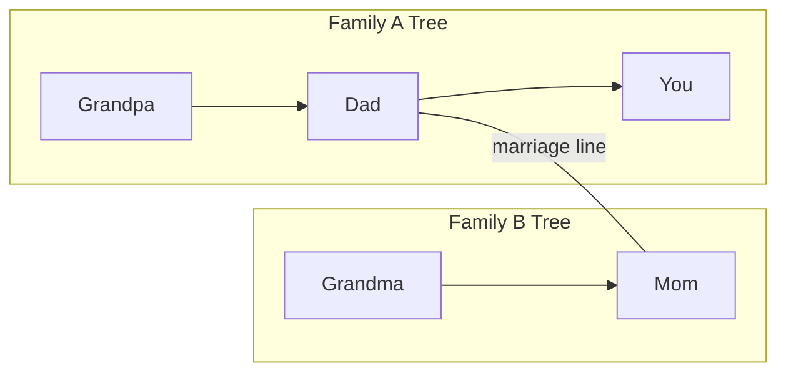

# Visual Family Tree — Design Spec

The core idea: **one tree per family, built from relationships. When a marriage connects two families, show both trees side by side with a single line between the couple. Everyone in both families sees the same view.**

No merged mega-tree. No complex graph math for users. Just trees + marriage lines.

---

## 1. Two layers of connections



| Layer | What connects | Where it lives | Visual |
|-------|---------------|----------------|--------|
| **Intra-family** | parent, spouse, sibling | Inside one family's tree | Normal tree edges |
| **Inter-family** | marriage only | `marriage_bridges` table | Horizontal line across the gap |

Everything inside a family uses **relationships**.  
The only thing that joins two families is a **marriage bridge**.

---

## 2. Single-family tree (intra-family)

### Nodes (`persons`)

Each person is a node. They may or may not have an app account.

```
Person {
  id, family_id, display_name, avatar_url
  user_id?          // null = placeholder / not on app yet
  birth_date?, death_date?
}
```

### Edges (`relationships`)

Only three types. Keep it minimal.

| Type | Meaning | Stored as |
|------|---------|-----------|
| `parent_of` | A is parent of B | directed: parent → child |
| `spouse_of` | A and B are married/partners | undirected (store once, lower id first) |
| `sibling_of` | A and B are siblings | undirected (optional; can infer from shared parent) |

**Rule:** The tree is always connected through parent-child links. Spouse and sibling links are horizontal ties on the same generation row.

### How the tree grows (onboarding)

When someone joins, they answer:
1. Who is your parent? → creates `parent_of` edge
2. Who is your spouse? (optional) → creates `spouse_of` edge
3. Who are your siblings? (optional) → creates `sibling_of` or infers from shared parent

The app validates:
- No one is their own parent
- No parent-child cycles
- Spouse link is reciprocated (if spouse is on app, prompt them to confirm)

### Layout (mobile)

Standard top-down family tree:

```
        [Grandpa]───[Grandma]
              │
        [Dad]───[Mom]
         /    \
    [You]    [Sister]
```

- **Vertical:** parent → child
- **Horizontal:** spouses sit on the same row, connected by a short line
- **Siblings:** same row, grouped under shared parents

Tap any node → bottom sheet: name, photo, "child of X", "spouse of Y", "sibling of Z".

---

## 3. Marriage bridge (inter-family) — the only cross-family link

### Trigger

Two families connect **only when a marriage happens** between one person in Family A and one person in Family B.

That's it. No other cross-family relationship types in v1.

### Data model

```sql
marriage_bridges (
  id              UUID PK,
  family_a_id     UUID FK -> families,
  person_a_id     UUID FK -> persons,   -- member of family_a
  family_b_id     UUID FK -> families,
  person_b_id     UUID FK -> persons,   -- member of family_b
  status          ENUM('pending', 'active'),
  created_at      TIMESTAMPTZ,
  UNIQUE(person_a_id, person_b_id)
)
```

One row = one marriage = one line on screen.

### How it gets created

**Option A — during onboarding (simplest):**  
User in Family B joins and says "my spouse is [Name] from Family A". If that person exists in Family A, system creates a pending bridge. Family A admin confirms → `active`.

**Option B — explicit connect flow:**  
Person A (Family A) taps their spouse node → "They're from another family" → search/invite Family B → pick the person → both admins confirm.

**Option C — both already married in各自的 trees:**  
Admin from either family initiates: "Connect our families — the link is between [Person A] and [Person B]". Other admin taps Accept.

All three end at the same place: one `marriage_bridges` row.

### What we deliberately do NOT do

- Do not merge trees into one graph
- Do not copy people from Family B into Family A's `persons` table
- Do not re-parent anyone across families
- Do not require users to understand "connections", "contexts", or "feed policies" to see the tree

---

## 4. Combined view — side by side + marriage line

### What everyone sees

Once a marriage bridge is `active`, **every member of Family A and every member of Family B** sees the same combined tree screen:

```
┌─────────────────────┐         ┌─────────────────────┐
│     Family A        │         │     Family B        │
│                     │         │                     │
│      [Grandpa]      │         │      [Grandma]      │
│          │          │         │          │          │
│       [Dad]─────────┼─────────┼──────[Mom]          │
│        / \          │ marriage│                     │
│    [You][Sis]       │  line   │    [Uncle]          │
│                     │         │       │             │
│                     │         │    [Cousin]           │
└─────────────────────┘         └─────────────────────┘
```

- Left panel = Family A tree (laid out independently)
- Right panel = Family B tree (laid out independently)
- **One line** drawn between `person_a` and `person_b` from the bridge
- Family name label on each panel
- Pinch-to-zoom on the whole canvas (both panels move together)

### Multiple marriages

If Family A has two siblings who married into Family B and Family C:

```
[Family A]          [Family B]
                    (via marriage 1)
[Family A]          [Family C]
                    (via marriage 2)
```

Show as one canvas with A in the center and B, C on the sides — each marriage gets its own line. Still no merging.

If Family B and Family C also connect (siblings marry siblings), you get three panels and two lines. The layout engine places family trees as **columns**, marriage lines as **cross-column edges**.

### Third family joins

Same rule: a marriage bridge is added. Canvas adds another column. No special logic.

---

## 5. API shape (what the mobile app needs)

### GET `/families/:id/tree`

Returns the caller's family tree only (Phase 2).

```json
{
  "family": { "id": "...", "name": "Sharma Family" },
  "nodes": [
    { "id": "p1", "displayName": "Dad", "avatarUrl": "...", "userId": "u1" }
  ],
  "edges": [
    { "from": "p0", "to": "p1", "type": "parent_of" },
    { "from": "p1", "to": "p2", "type": "spouse_of" }
  ]
}
```

### GET `/families/:id/tree/combined`

Returns all trees the family is linked to via active marriages (Phase 6, but tree-only).

```json
{
  "trees": [
    {
      "family": { "id": "fa", "name": "Sharma Family" },
      "nodes": [...],
      "edges": [...]
    },
    {
      "family": { "id": "fb", "name": "Patel Family" },
      "nodes": [...],
      "edges": [...]
    }
  ],
  "marriages": [
    {
      "id": "m1",
      "personAId": "p_dad_sharma",
      "personBId": "p_mom_patel",
      "familyAId": "fa",
      "familyBId": "fb"
    }
  ]
}
```

The mobile app:
1. Lays out each tree in `trees[]` independently (column per family)
2. Draws marriage lines using `marriages[]` by node id
3. No server-side layout coordinates needed for v1 — client computes positions

---

## 6. Layout algorithm (client-side, kept simple)

### Per-family layout

1. Find root nodes (people with no parents in this family)
2. BFS/DFS downward for generations
3. Place spouses on same row, centered between their children
4. Group siblings left-to-right by age (or join order if no birth date)

Use a library if helpful:
- **React Native:** custom SVG (`react-native-svg`) or `@shopify/react-native-skia`
- **Web fallback:** `d3-hierarchy` for layout, render with SVG

### Cross-family marriage lines

After each family column is laid out:

1. For each `marriage` in `marriages[]`, find screen position of `personA` and `personB`
2. Draw a cubic bezier or straight line between them
3. Style: distinct color (e.g. gold/rose), slightly thicker than spouse-within-family lines

```
personA (right edge of column A) ---- marriage line ---- personB (left edge of column B)
```

### Column ordering

Put the **caller's home family** in the center or leftmost. Other families ordered by `created_at` of the bridge.

---

## 7. Visibility rules

| User is in… | Can see… |
|-------------|----------|
| Family A only (no bridges) | Family A tree |
| Family A, bridged to B | Combined view: A + B trees + marriage line(s) |
| Family A, bridged to B and C | Combined view: A + B + C |

**No toggle. No permission matrix for the tree.** If your family is connected, you see both trees. Period.

(Feed/chat sharing can stay configurable later — the tree is always fully visible to both sides.)

---

## 8. Edge cases

| Case | Handling |
|------|----------|
| Spouse not on app yet | Placeholder node in own family; bridge pending until they join |
| Divorce / bridge removed | Set bridge `status = dissolved`; trees separate again on screen |
| Same person accidentally in two families | Should not happen — `persons.family_id` is fixed. User can be in multiple families via separate person nodes |
| Siblings marry siblings (two bridges) | Two lines, three columns — works naturally |
| Large trees (100+ nodes) | Collapse subtrees ("show more"), lazy-load branches |

---

## 9. Simplified schema vs full plan

We can drop or defer for tree purposes:

| Full plan concept | Tree simplification |
|-------------------|---------------------|
| `connections` entity with feed policies | Not needed for tree — `marriage_bridges` is enough |
| `connection_memberships` | Bridge implies membership for tree visibility |
| `user_active_context` switcher | Not needed for tree view |
| Side-by-side + unified feed toggle | Tree always shows all linked families |

Keep `marriage_bridges` (rename from `bridge_links`). Feed/social features can reference the same bridge later.

---

## 10. Implementation order

### Phase 2 — single tree
- [ ] `persons` + `relationships` tables
- [ ] Onboarding creates edges
- [ ] `GET /families/:id/tree` endpoint
- [ ] Mobile: single-tree SVG view, pinch-zoom, node tap

### Phase 6 (tree slice only) — marriage bridge
- [ ] `marriage_bridges` table
- [ ] Confirm flow (both admins or both spouses)
- [ ] `GET /families/:id/tree/combined` endpoint
- [ ] Mobile: multi-column layout + marriage lines

---

## 11. Visual reference (ASCII)

**Before marriage (two separate families, neither sees the other):**

```
Family A                          Family B
  [Grandpa]                         [Grandma]
      │                                 │
   [Dad]──[Step-mom]                  [Mom]
    /   \
 [You] [Bro]
```

**After Dad (A) marries Mom (B) — everyone sees:**

```
┌─── Sharma Family ───┐     ┌─── Patel Family ───┐
│      [Grandpa]      │     │      [Grandma]     │
│          │          │     │          │         │
│  [Dad]══════════════╪═════╪══════[Mom]         │
│    /   \            │     │                    │
│ [You] [Bro]         │     │                    │
└─────────────────────┘     └────────────────────┘
         ↑                           ↑
    person_a_id                 person_b_id
              marriage_bridge
```

Tap Dad → "Married to Mom (Patel Family)".  
Tap Mom → "Married to Dad (Sharma Family)".  
Tap You → "Child of Dad", tree stays in Sharma column.

---

## Summary

1. **One tree per family** — parent/spouse/sibling edges only
2. **Marriage is the only bridge** between families — one DB row, one visual line
3. **Side by side** — each family's tree laid out in its own column
4. **Everyone sees everything** — both families get the full combined view
5. **Client draws the line** — server sends nodes, edges, and marriage pairs; app handles layout

That's the whole model. No rocket science.
