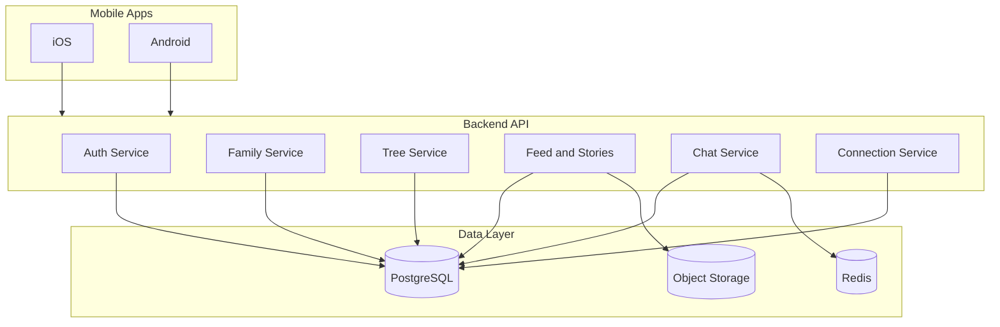
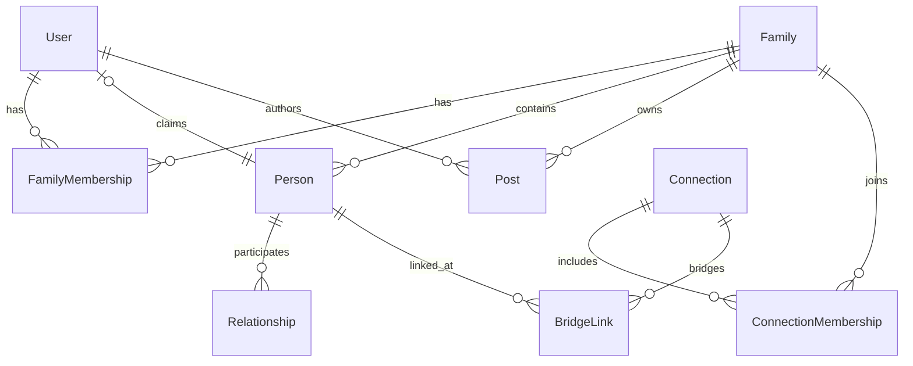
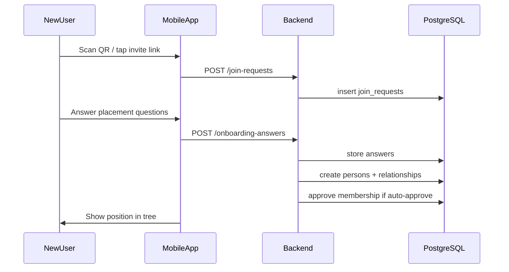
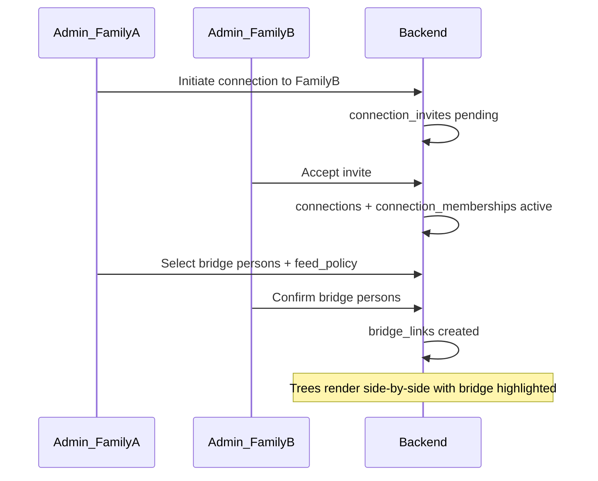
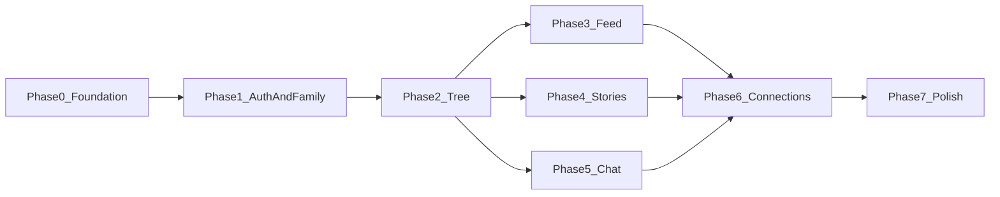

# Family Social App — Requirements & Schema Design

## Product vision (one sentence)

A private, mobile-first family network where members join via invite/QR, the family tree grows from onboarding answers, families share media and chat, and multiple families can "connect" with configurable feeds while keeping side-by-side trees linked at marriage/union points.

---

## Assumptions (documented defaults)

- **Platform:** Mobile-first (iOS + Android); API-first backend so web can come later.
- **Auth:** Phone number + OTP (WhatsApp-style), like [Firebase Auth phone](https://firebase.google.com/docs/auth) or similar.
- **Tree growth:** Tree is **emergent** — built as members join and answer placement questions, not manually drawn by admin first.
- **Admin powers:** Invite by phone, generate QR, approve join requests, manage connection settings — not hand-edit every tree edge.
- **Deceased members:** Supported as tree nodes without user accounts (added via questions or admin).

---

## Actors & roles

| Actor | Capabilities |
|-------|-------------|
| **User** | Registered person with phone; may belong to 1+ families |
| **Family Admin** | Invite/add members, approve requests, configure family + connection settings |
| **Family Member** | Post, story, chat, view tree/feed within permitted scope |
| **System** | Validates tree answers, resolves conflicts, merges placeholder nodes |

A user can be admin in one family and member in another.

---

## Core feature requirements

### 1. Registration & join flows

**FR-1.1** User registers with phone + OTP and basic profile (name, photo optional).

**FR-1.2** Join paths (any of):
- Scan family **QR / invite code** → pending join request
- Admin adds **phone number** → invite SMS with deep link
- Admin shares **invite link**

**FR-1.3** After auth, user completes **placement questionnaire** (2–5 questions):
- "Which family are you joining?" (if multiple pending)
- "Who is your parent?" (pick existing member or "not in app yet" → creates placeholder)
- "Who is your spouse?" (optional)
- "Who are your siblings?" (optional, multi-select)
- Confirmation screen before commit

**FR-1.4** App validates answers (no cycles, age sanity checks, spouse reciprocity prompts).

**FR-1.5** Admin can **approve/reject** join requests if family requires approval (configurable).

**FR-1.6** When a placeholder node later registers (same phone or claimed via invite), **merge** placeholder → user account.

### 2. Family tree

**FR-2.1** Each **Family** owns one tree graph.

**FR-2.2** Tree node = a **Person** (may or may not have a linked User account).

**FR-2.3** Supported relationship types: `parent_of`, `spouse_of`, `sibling_of` (sibling can be inferred or explicit).

**FR-2.4** Tree UI: zoomable graph; tap node → profile card ("son of X, spouse of Y").

**FR-2.5** Admin cannot freely redraw tree; corrections go through **relationship dispute / edit request** flow (audit logged).

### 3. Social feed (Instagram-like)

**FR-3.1** Posts support text, photos, videos, multi-image albums.

**FR-3.2** Chronological + optional "recent" scroll feed (v1: reverse-chronological is enough).

**FR-3.3** Reactions and comments on posts.

**FR-3.4** Feed scope is determined by **active context** (see §6).

### 4. Stories (status-style)

**FR-4.1** Photo/video stories expire after 24h (configurable).

**FR-4.2** Story ring on home; tap to view full-screen.

**FR-4.3** Optional view list (who saw your story) — family-only visibility.

### 5. Messaging

**FR-5.1** 1:1 DMs between family members (within same family).

**FR-5.2** Group chats (family-wide or custom subset).

**FR-5.3** Cross-family DMs only when families share a **Connection** and policy allows it.

**FR-5.4** Media in messages (photos, videos, voice notes — v2).

### 6. Family connections (multi-family unite)

**FR-6.1** Two or more families can form a **Connection** (e.g., marriage between members of Family A and B).

**FR-6.2** Connection is initiated by admins from each family; both sides accept.

**FR-6.3** **Bridge link** records which Person nodes connect the families (typically spouse pair across trees).

**FR-6.4** Tree display in a connection: **side-by-side trees** with bridge highlighted — not a merged single tree.

**FR-6.5** Per-connection **feed policy** (admin-configurable):

| Mode | Behavior |
|------|----------|
| `unified_feed` | One shared feed across all families in the connection |
| `separate_feeds` | Each family keeps its own feed; connection view can toggle between them |
| `selective_share` (v2) | Per-post choice to share into connection |

**FR-6.6** A family can be in **multiple connections** simultaneously (A↔B and A↔C).

**FR-6.7** **Context switcher** (like account switcher): user picks active Family + optional Connection lens. UI, feed, stories, and chat all respect active context.

**FR-6.8** Third (or Nth) family joins an existing connection via the same accept flow.

### 7. Admin & privacy

**FR-7.1** Family settings: name, photo, join approval required (Y/N), who can invite.

**FR-7.2** Remove/ban member (soft-delete; tree node may remain as historical).

**FR-7.3** All content private to family/connection — no public discovery.

---

## Non-functional requirements

| ID | Requirement |
|----|-------------|
| NFR-1 | Mobile offline-tolerant read cache for feed/tree (sync on reconnect) |
| NFR-2 | Media stored in object storage (S3/GCS) with CDN; max video length TBD (e.g. 60s stories, 5min posts) |
| NFR-3 | Real-time updates for chat, stories, feed (WebSocket or push + poll) |
| NFR-4 | Tree queries: "who is X's parent?" in &lt;100ms for trees up to ~500 nodes |
| NFR-5 | Audit log for relationship changes and connection events |
| NFR-6 | GDPR-style data export + account deletion |

---

## High-level architecture



**Recommended stack (for when you build):**
- **Mobile:** React Native (Expo) or Flutter
- **API:** Node.js (NestJS) or Go
- **DB:** PostgreSQL — best fit for relational tree + social graph
- **Cache/PubSub:** Redis
- **Media:** S3 + CloudFront / Cloudflare R2
- **Push:** FCM + APNs

---

## Domain model (conceptual)



**Key design choice:** `Person` (tree entity) is separate from `User` (app account). This supports placeholders, deceased relatives, and claiming accounts later.

---

## Database schema (PostgreSQL)

### Identity & families

```sql
-- users: app accounts (phone auth)
users (
  id            UUID PK,
  phone         VARCHAR UNIQUE NOT NULL,
  display_name  VARCHAR NOT NULL,
  avatar_url    TEXT,
  created_at    TIMESTAMPTZ,
  updated_at    TIMESTAMPTZ
)

-- families: isolated family units
families (
  id            UUID PK,
  name          VARCHAR NOT NULL,
  avatar_url    TEXT,
  invite_code   VARCHAR UNIQUE,        -- for QR
  settings      JSONB DEFAULT '{}',    -- { require_approval, who_can_invite, ... }
  created_at    TIMESTAMPTZ
)

-- family_memberships: user <-> family with role
family_memberships (
  id            UUID PK,
  family_id     UUID FK -> families,
  user_id       UUID FK -> users,
  role          ENUM('admin','member'),
  status        ENUM('pending','active','removed'),
  joined_at     TIMESTAMPTZ,
  UNIQUE(family_id, user_id)
)
```

### Family tree

```sql
-- persons: nodes in a family's tree (with or without app account)
persons (
  id            UUID PK,
  family_id     UUID FK -> families,
  user_id       UUID FK -> users NULL,  -- null = placeholder/deceased/unclaimed
  display_name  VARCHAR NOT NULL,
  phone         VARCHAR NULL,           -- for admin-invited placeholders
  birth_date    DATE NULL,
  death_date    DATE NULL,
  gender        VARCHAR NULL,           -- for layout hints only
  avatar_url    TEXT,
  is_placeholder BOOLEAN DEFAULT false,
  created_at    TIMESTAMPTZ,
  UNIQUE(family_id, user_id) WHERE user_id IS NOT NULL
)

-- relationships: directed edges (store canonical direction + type)
relationships (
  id            UUID PK,
  family_id     UUID FK -> families,
  from_person_id UUID FK -> persons,
  to_person_id   UUID FK -> persons,
  type          ENUM('parent_of','spouse_of','sibling_of'),
  source        ENUM('onboarding','admin','inferred'),
  created_at    TIMESTAMPTZ,
  UNIQUE(family_id, from_person_id, to_person_id, type)
)
-- parent_of: from_person is parent of to_person
-- spouse_of: store once with from_person_id < to_person_id convention
```

**Tree query strategy:** For ancestry ("son of whom"), use recursive CTE on `relationships` where `type = 'parent_of'`. Add a **closure table** (`person_ancestors`) later if trees exceed ~200 nodes and queries slow down.

### Onboarding & invites

```sql
-- join_requests: QR / invite flow
join_requests (
  id            UUID PK,
  family_id     UUID FK -> families,
  user_id       UUID FK -> users,
  status        ENUM('pending','approved','rejected'),
  invite_code   VARCHAR NULL,
  created_at    TIMESTAMPTZ
)

-- onboarding_answers: raw answers before tree commit
onboarding_answers (
  id            UUID PK,
  join_request_id UUID FK -> join_requests,
  question_key  VARCHAR,               -- 'parent', 'spouse', 'siblings'
  answer_json   JSONB,                 -- { person_id } or { name, phone } for placeholder
  created_at    TIMESTAMPTZ
)
```

**Onboarding commit logic (application layer):**
1. Create `persons` row for new user (link `user_id`)
2. Create `relationships` from answers
3. Create placeholder `persons` for "not in app yet" answers
4. Prompt existing members to confirm spouse/sibling reciprocity if missing

### Social: feed, stories, engagement

```sql
posts (
  id            UUID PK,
  family_id     UUID FK -> families,
  author_user_id UUID FK -> users,
  caption       TEXT,
  visibility    ENUM('family','connection'),  -- connection = shared into active connection
  connection_id UUID FK -> connections NULL,
  created_at    TIMESTAMPTZ
)

post_media (
  id            UUID PK,
  post_id       UUID FK -> posts,
  media_type    ENUM('image','video'),
  url           TEXT NOT NULL,
  thumbnail_url TEXT,
  sort_order    INT
)

post_reactions (
  post_id       UUID FK,
  user_id       UUID FK,
  emoji         VARCHAR,
  PRIMARY KEY (post_id, user_id)
)

post_comments (
  id            UUID PK,
  post_id       UUID FK,
  author_user_id UUID FK,
  body          TEXT,
  created_at    TIMESTAMPTZ
)

stories (
  id            UUID PK,
  family_id     UUID FK,
  author_user_id UUID FK,
  media_type    ENUM('image','video'),
  url           TEXT,
  expires_at    TIMESTAMPTZ,
  created_at    TIMESTAMPTZ
)

story_views (
  story_id      UUID FK,
  viewer_user_id UUID FK,
  viewed_at     TIMESTAMPTZ,
  PRIMARY KEY (story_id, viewer_user_id)
)
```

### Connections (multi-family unite)

```sql
connections (
  id            UUID PK,
  name          VARCHAR NULL,           -- e.g. "Smith & Patel"
  feed_policy   ENUM('unified_feed','separate_feeds') DEFAULT 'separate_feeds',
  status        ENUM('pending','active','dissolved'),
  created_at    TIMESTAMPTZ
)

connection_memberships (
  id            UUID PK,
  connection_id UUID FK -> connections,
  family_id     UUID FK -> families,
  status        ENUM('pending','active','left'),
  joined_at     TIMESTAMPTZ,
  UNIQUE(connection_id, family_id)
)

-- bridge_links: cross-family tree links (typically spouse across trees)
bridge_links (
  id            UUID PK,
  connection_id UUID FK -> connections,
  family_a_id   UUID FK -> families,
  person_a_id   UUID FK -> persons,
  family_b_id   UUID FK -> families,
  person_b_id   UUID FK -> persons,
  link_type     ENUM('spouse','other') DEFAULT 'spouse',
  created_at    TIMESTAMPTZ
)

-- connection_invites: admin-to-admin accept flow
connection_invites (
  id            UUID PK,
  from_family_id UUID FK,
  to_family_id   UUID FK,
  initiated_by_user_id UUID FK,
  status        ENUM('pending','accepted','declined'),
  created_at    TIMESTAMPTZ
)
```

### Messaging

```sql
chats (
  id            UUID PK,
  family_id     UUID FK NULL,
  connection_id UUID FK NULL,
  type          ENUM('direct','group'),
  name          VARCHAR NULL,
  created_at    TIMESTAMPTZ
)

chat_participants (
  chat_id       UUID FK,
  user_id       UUID FK,
  PRIMARY KEY (chat_id, user_id)
)

messages (
  id            UUID PK,
  chat_id       UUID FK,
  sender_user_id UUID FK,
  body          TEXT NULL,
  media_url     TEXT NULL,
  created_at    TIMESTAMPTZ
)
```

### User context (the "switcher")

```sql
user_active_context (
  user_id       UUID PK FK -> users,
  family_id     UUID FK -> families,
  connection_id UUID FK -> connections NULL,  -- null = family-only lens
  updated_at    TIMESTAMPTZ
)
```

---

## How key flows map to schema

### Join + tree placement



### Two families unite



### Context switcher

When user switches from "Family A + Connection(A,B)" to "Family A + Connection(A,C)":
- Update `user_active_context`
- Feed query changes:

```sql
-- unified_feed in connection
SELECT * FROM posts
WHERE connection_id = :active_connection_id
  AND visibility = 'connection'
ORDER BY created_at DESC;

-- separate_feeds (family lens)
SELECT * FROM posts
WHERE family_id = :active_family_id
  AND visibility = 'family'
ORDER BY created_at DESC;
```

---

## Phased delivery roadmap

Each phase ships a usable increment. Later phases depend on earlier ones — do not skip Phase 0–2.



---

### Phase 0 — Project foundation

**Goal:** Empty repo → runnable backend + mobile app talking to a local database.

| Area | Deliverables |
|------|-------------|
| Repo | Monorepo or `api/` + `mobile/` folders, README, `.env.example` |
| Backend | NestJS (or Go) skeleton, health check, Docker Compose for PostgreSQL + Redis |
| Mobile | Expo app shell, navigation (tabs placeholder), API client |
| DevOps | Local migrations tool (Prisma or Drizzle), lint/format, basic CI |

**Schema:** none yet (migration tooling only).

**Exit criteria:**
- `docker compose up` starts Postgres
- Mobile app hits `GET /health` and shows OK
- One empty migration runs cleanly

**Estimated effort:** 2–4 days

---

### Phase 1 — Auth, profiles & family core

**Goal:** A user can register, create a family (becoming admin), and invite others.

**Requirements covered:** FR-1.1, FR-1.2 (partial), FR-7.1, FR-7.3

| Feature | Detail |
|---------|--------|
| Phone OTP auth | Register / login via phone + OTP |
| User profile | Name, optional avatar upload |
| Create family | First user becomes admin; family name + photo |
| Invite code + QR | Generate `invite_code`; display QR for scanning |
| Admin invite by phone | Admin enters phone → pending invite (SMS stub OK in dev) |
| Join request | Scan QR / enter code → `join_requests` row (approval in Phase 2) |
| Admin settings | Family name, avatar, `require_approval` flag |

**Schema tables:** `users`, `families`, `family_memberships`, `join_requests`

**Key screens:**
- Login / OTP
- Profile setup
- Create family OR "I have an invite code"
- Family home (placeholder)
- Admin: invite screen (QR + phone + link)
- Admin: pending requests list (read-only until Phase 2)

**Key API endpoints:**
- `POST /auth/otp/send`, `POST /auth/otp/verify`
- `GET/PATCH /users/me`
- `POST /families`, `GET /families/:id`
- `POST /families/:id/invites`, `POST /join-requests`
- `GET /families/:id/join-requests` (admin)

**Exit criteria:**
- User A creates family, shares QR
- User B scans QR, account created, join request appears in A's admin panel
- Admin can invite by phone number (deep link or code)

**Estimated effort:** 1–2 weeks

---

### Phase 2 — Onboarding & emergent family tree

**Goal:** New members answer placement questions; the family tree grows automatically.

**Requirements covered:** FR-1.3, FR-1.4, FR-1.5, FR-2.1–FR-2.4, FR-7.2 (partial)

| Feature | Detail |
|---------|--------|
| Placement questionnaire | Parent (required), spouse (optional), siblings (optional) |
| Placeholder nodes | "Not in app yet" → `persons` row with `is_placeholder=true` |
| Tree commit | Answers → `persons` + `relationships` rows |
| Validation | No self-parent, basic age sanity, duplicate spouse checks |
| Admin approval | Approve/reject `join_requests` when `require_approval=true` |
| Tree viewer | Zoomable graph; tap node → "child of X, spouse of Y" |
| Founding member | First admin is root `person` when family is created |

**Schema tables:** `persons`, `relationships`, `onboarding_answers`

**Key screens:**
- Onboarding wizard (step-by-step questions)
- Confirm placement summary
- Tree tab (interactive graph)
- Person detail bottom sheet
- Admin: approve/reject join requests

**Key API endpoints:**
- `POST /join-requests/:id/onboarding`
- `POST /join-requests/:id/approve|reject`
- `GET /families/:id/tree`
- `GET /persons/:id` (lineage summary)

**Exit criteria:**
- 3+ users join via QR, answer questions, tree renders correctly
- Placeholder parent created when user says "dad not on app yet"
- Admin can approve/reject pending members
- Tapping any node shows parent/spouse info

**Estimated effort:** 2–3 weeks

---

### Phase 3 — Social feed

**Goal:** Instagram-style scrollable feed for the whole family.

**Requirements covered:** FR-3.1–FR-3.3, FR-3.4 (family scope only), NFR-2 (partial)

| Feature | Detail |
|---------|--------|
| Create post | Text + single/multi photo + video |
| Media upload | Presigned S3/R2 upload from mobile |
| Feed | Reverse-chronological infinite scroll |
| Engagement | Reactions (emoji) + comments |
| Post detail | Full post view with comment thread |

**Schema tables:** `posts`, `post_media`, `post_reactions`, `post_comments`

**Key screens:**
- Home feed tab
- Create post (camera roll / camera)
- Post detail + comments
- Profile → my posts

**Key API endpoints:**
- `POST /posts`, `GET /families/:id/feed`
- `POST /posts/:id/reactions`, `POST /posts/:id/comments`
- `POST /media/presign`

**Exit criteria:**
- Family members post photos/videos; all see same feed
- Reactions and comments work in real time (poll OK for v1; WebSocket in Phase 7)

**Estimated effort:** 2 weeks

---

### Phase 4 — Stories

**Goal:** WhatsApp/Instagram-style 24-hour status rings at top of home.

**Requirements covered:** FR-4.1–FR-4.3

| Feature | Detail |
|---------|--------|
| Post story | Photo or short video (≤60s) |
| Story ring | Horizontal row on home; unseen = highlighted ring |
| Viewer | Full-screen tap-through between family members' stories |
| Expiry | Cron/job deletes or hides stories after 24h |
| View list | Author sees who viewed (family only) |

**Schema tables:** `stories`, `story_views`

**Key screens:**
- Story composer (camera)
- Story viewer (fullscreen)
- Viewers list

**Key API endpoints:**
- `POST /stories`, `GET /families/:id/stories`
- `POST /stories/:id/view`, `GET /stories/:id/viewers`

**Exit criteria:**
- Stories appear in ring, expire after 24h
- Family members can view each other's stories
- Author sees viewer list

**Estimated effort:** 1 week

---

### Phase 5 — Messaging

**Goal:** Family members can DM each other and join group chats.

**Requirements covered:** FR-5.1, FR-5.2, NFR-3 (partial)

| Feature | Detail |
|---------|--------|
| 1:1 DM | Start chat with any family member |
| Group chat | Create named group; add family members |
| Family-wide chat | Auto-created group for whole family (optional) |
| Text + image messages | Media via same upload pipeline as feed |
| Real-time | WebSocket or Supabase-style subscription for new messages |
| Chat list | Unread badges, last message preview |

**Schema tables:** `chats`, `chat_participants`, `messages`

**Key screens:**
- Chats tab (inbox)
- Conversation thread
- New chat / new group picker

**Key API endpoints:**
- `GET/POST /chats`, `GET/POST /chats/:id/messages`
- WebSocket: `chat:message` events

**Exit criteria:**
- 1:1 and group messaging works with text + images
- New messages appear without manual refresh

**Estimated effort:** 2 weeks

---

### Phase 6 — Family connections (multi-family unite)

**Goal:** Two or more families connect; trees sit side-by-side; feeds can be shared or separate; users switch context.

**Requirements covered:** FR-1.6, FR-3.4, FR-5.3, FR-6.1–FR-6.8

| Feature | Detail |
|---------|--------|
| Connection invite | Admin A invites Admin B's family |
| Accept flow | Both admins accept; pick bridge persons (spouse pair) |
| Side-by-side trees | Connection tree view: Family A tree + Family B tree + bridge link |
| Feed policies | `unified_feed` vs `separate_feeds` per connection |
| Context switcher | User picks active family + optional connection lens |
| N-family join | Third family joins existing connection |
| Cross-family visibility | In unified mode, posts with `visibility=connection` appear in shared feed |
| Placeholder merge | When placeholder registers, link `user_id` to existing `persons` row |
| Multi-connection | Family A connected to B and separately to C |

**Schema tables:** `connections`, `connection_memberships`, `bridge_links`, `connection_invites`, `user_active_context`

**Also updates:** `posts.visibility`, `posts.connection_id`; optional `chats.connection_id`

**Key screens:**
- Admin: invite another family
- Admin: connection settings (feed policy, bridge persons)
- Context switcher (header dropdown)
- Connection tree view (dual/triple panels)
- Post composer: "share to connection" toggle (when in unified mode)

**Key API endpoints:**
- `POST /connection-invites`, `PATCH /connection-invites/:id`
- `GET/PATCH /connections/:id`
- `POST /connections/:id/bridge-links`
- `PATCH /users/me/context`
- `GET /connections/:id/feed`, `GET /connections/:id/tree`

**Exit criteria:**
- Two families connect; bridge link shows who married whom
- Unified feed shows posts from both families
- Separate mode: user toggles between family feeds
- Third family can join same connection
- User in Family A switches between Connection(A,B) and Connection(A,C)

**Estimated effort:** 3–4 weeks

---

### Phase 7 — Polish, trust & scale

**Goal:** Production-ready quality: notifications, offline, governance, compliance.

**Requirements covered:** FR-2.5, FR-5.4, FR-6.5 (selective_share), NFR-1, NFR-3–NFR-6

| Feature | Detail |
|---------|--------|
| Push notifications | New message, join request, connection invite, story, mention |
| Offline cache | Feed + tree cached locally; sync on reconnect |
| Relationship disputes | Member requests correction; admin approves; audit log |
| Selective share | Per-post toggle to share into connection (even in separate mode) |
| Voice notes in chat | Audio upload + playback |
| Audit log | `audit_events` table for tree + connection changes |
| Account lifecycle | Export my data, delete account |
| Performance | `person_ancestors` closure table if trees >200 nodes |
| Video limits | Enforce max duration; thumbnail generation |

**Schema tables:** `audit_events` (+ indexes on hot queries)

**Exit criteria:**
- Push notifications on iOS + Android for core events
- App usable offline for reading feed/tree
- Relationship edit flow works with full audit trail
- Account deletion removes PII per policy

**Estimated effort:** 3–4 weeks

---

## Phase summary

| Phase | Name | Ships | Depends on |
|-------|------|-------|------------|
| 0 | Foundation | Dev environment | — |
| 1 | Auth & family core | Register, create family, invite | 0 |
| 2 | Tree & onboarding | Question-driven tree, approvals | 1 |
| 3 | Feed | Posts, media, reactions | 2 |
| 4 | Stories | 24h status rings | 2 |
| 5 | Chat | DMs + groups | 2 |
| 6 | Connections | Multi-family unite, switcher | 3, 4, 5 |
| 7 | Polish | Notifications, offline, audit | 6 |

**MVP milestone (usable by one family):** Phases 0–5 complete.

**Full vision milestone:** Phase 7 complete.

**Total rough estimate:** 14–20 weeks for a small team (1–2 devs).

---

## What to build first (recommended order)

1. **Phase 0** — scaffold everything
2. **Phase 1** — auth + invites (no tree yet, but family exists)
3. **Phase 2** — tree onboarding (the differentiator — prioritize this over feed)
4. **Phase 3** — feed (core daily-use feature)
5. **Phase 5** — chat (families will want to talk)
6. **Phase 4** — stories (lighter than chat, can swap with 5)
7. **Phase 6** — connections (your unique multi-family feature)
8. **Phase 7** — polish before App Store launch

---

## Open decisions (can defer)

- Exact onboarding question set per culture (matrilineal/patrilineal naming, step-parents, adoption)
- Video length limits and storage costs
- Whether stories are per-family or per-connection in unified mode
- End-to-end encryption for chats (significant complexity; v2)

---

**Suggested next step**

Start **Phase 2**:
1. Placement questionnaire + `persons` / `relationships`
2. Admin approve/reject join requests
3. Interactive tree viewer
